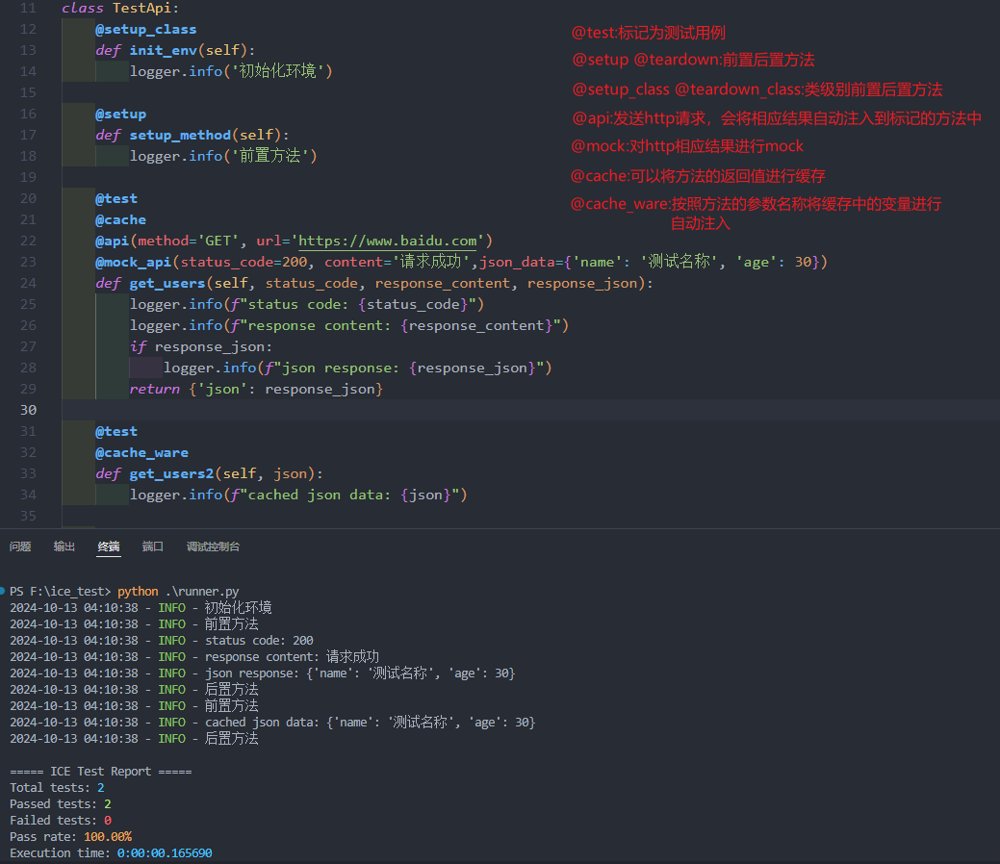

## ICE-Test

#### 简介

ICE-Test是一个由python语言设计的单元测试框架，去除了`unittest`框架需要继承`TestCase`以及`pytest`需要规范类名的问题，采用装饰器驱动测试人员编写测试用例，这一思想主要来源于Java语言，实际上Java注解只有标记的功能，而装饰器是装饰者模式的语法糖，二者有着截然差异，然后又结合了Spring框架的包扫描机制以及部分功能的依赖注入，测试用例通常不会用到`return`关键字，所以有凭空臆想，觉得返回值在其它测试用例可能会用到，所以又对缓存进行设计，让方法支持缓存变量注入

看到很多教程发送`http`请求都是类似于`requests.post(url,body)`这种语法，看起来一点也不美观，所以这块可以通过`@api`装饰器发送请求，将响应自动填充到方法参数中，这样的做法看起来像是`SpringMVC`哈哈

写这个框架的目的主要是无聊哈哈 :laughing:

#### 使用截图

作者:冰点契约

[个人博客](https://ice-pact.blog.csdn.net/)

如果觉得有用的话给个 :star: 吧
